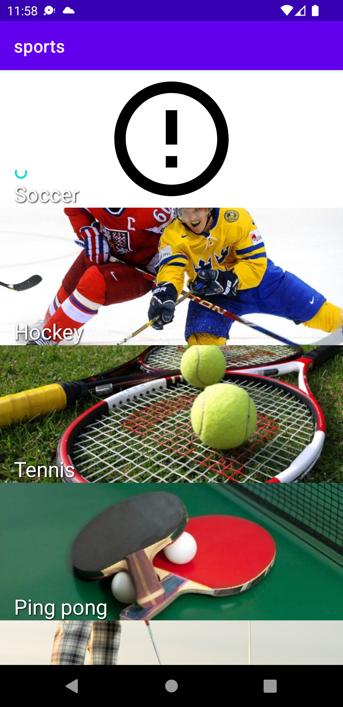

# Guided Android projects

## wild-running

#### Guided by [Programación de Aplicaciones para Android con Kotlin 2022](https://www.udemy.com/course/programacion-de-aplicaciones-android-kotlin/)

### Description

Sports related application which allows you to track the distance and the path of your run (or bike ride). It stores and analyzes your runs data, calculates your records, and allows you to take a photo of your run.

### Technology and purpose

- Activities interaction and intents
- Firebase services:
  - Login with email and with Google
  - Database
  - Storage
- Music
- GPS
- Camera
- RecyclerView
- Widget

## chesstour

#### Guided by [Programación de Aplicaciones para Android con Kotlin 2022](https://www.udemy.com/course/programacion-de-aplicaciones-android-kotlin/)

### Description

Chess turn-based game where you need to move the knight visiting each square exactly once.

### Technology and purpose

- Create views programmatically

## sports

#### Guided by [Minicurso: Adaptadores en Android con Kotlin](https://www.udemy.com/course/minicurso-adaptadores-en-android-con-kotlin/)

### Description

Application which main purpose is to learn how RecyclerView adapters work.

### Technology and purpose

- Use of RecyclerView and two types of adapters
	- Adapter, ListAdapter

## top

#### Guided by [Android: Fundamentos para crear tus primeras apps de calidad](https://www.udemy.com/course/fundamentos-de-android-para-crear-apps-de-calidad/)

### Description

Application which shows a list of actors where you can edit them, remove them or add new elements.

### Technology and purpose

- RecyclerView + Adapter
- Room
- Activities interaction and intents

##  soccerquiz

#### Guided by [Android разработка - с нуля до профессионала. Полный курс](https://www.udemy.com/course/android-kak-po-notam-a/)

### Description

Application which contains a simple quiz of three random questions about soccer.

### Technology and purpose

- Use of fragments and navigation between different fragments

## counter

#### Guided by [Android разработка - с нуля до профессионала. Полный курс](https://www.udemy.com/course/android-kak-po-notam-a/)

### Description

Application with a simple counter

### Technology and purpose

- Use of LiveData for the purpose of saving data after screen rotation

## databindingdemo

#### Guided by [Android разработка - с нуля до профессионала. Полный курс](https://www.udemy.com/course/android-kak-po-notam-a/)

### Description

Demo application which purpose is to learn the Data Binding library

### Technology and purpose

- Data Binding library

## favouritemovies

#### Guided by [Android разработка - с нуля до профессионала. Полный курс](https://www.udemy.com/course/android-kak-po-notam-a/)

### Description

Application which shows different movies ordered by genre with CRUD operations

### Technology and purpose

- MVVM
- Room CRUD operations

## retrofitdemo

#### Guided by [Android разработка - с нуля до профессионала. Полный курс](https://www.udemy.com/course/android-kak-po-notam-a/)

### Description

Application which fetches some simple data from an API and shows it

### Technology and purpose

- Retrofit

## moviesapi

#### Guided by [Android разработка - с нуля до профессионала. Полный курс](https://www.udemy.com/course/android-kak-po-notam-a/)

### Description

Application which shows different movies loaded from internet

### Technology and purpose

- MVVM
- RecyclerView + Paging library
- Retrofit

## didemo

#### Guided by [Android разработка - с нуля до профессионала. Полный курс](https://www.udemy.com/course/android-kak-po-notam-a/)

### Description

Application which builds a complex object using various dependency injection methods

### Technology and purpose

- Dagger

## shoppinglist

#### Guided by [Android профессиональный уровень](https://www.udemy.com/course/android_prof/)

### Description

Application which allows to add items to a shopping list, edit and remove them

### Technology and purpose

- MVVM & Clean Architecture
- Improved RecyclerView with ListAdapter
- Data Binding

## composition

#### Guided by [Android профессиональный уровень](https://www.udemy.com/course/android_prof/)

### Description

Simple game related to maths composed by a single activity with multiple fragments

### Technology and purpose

- MVVM & Clean Architecture
- FragmentManager and Jetpack Navigation
- Data Binding

## coroutinestart

#### Guided by [Android профессиональный уровень](https://www.udemy.com/course/android_prof/)

### Description

Introductory coroutines project

### Technology and purpose

- Coroutines

## services

#### Guided by [Android профессиональный уровень](https://www.udemy.com/course/android_prof/)

### Description

Introductory services project

### Technology and purpose

- Services, WorkManager

## cartandnotes

#### Guided by [Room Persistance Librar - Приложение ShoppingList на Котлин]([https://www.udemy.com/course/android_prof/](https://www.udemy.com/course/room-persistance-librar-shoppinglist/))

### Description

An application which allow to create and edit notes and lists of shopping items. Each list has its own items which can also be edited. There is an options screen which allows to change some preferences such as text size, date format or app colors.

	
	&nbsp; &nbsp; &nbsp; &nbsp;
	
	&nbsp; &nbsp; &nbsp; &nbsp;
	

### Technology and purpose

- MVVM & Clean Architecture
- Room with coroutines
- Usage of fragments and bottom navigation menu
- Settings and shared preferences
